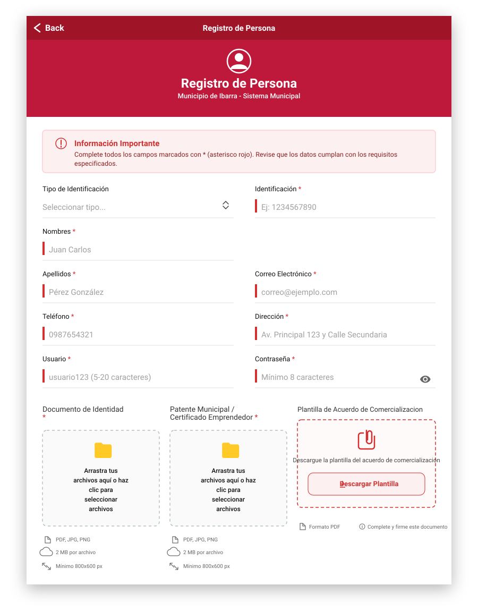
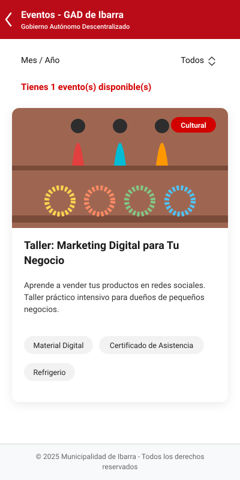

# Funcionalidad: Eventos

Esta sección documenta la funcionalidad de "Eventos" incluida en la aplicación móvil (GAD Ibarra). Contiene descripción, archivos relevantes, cómo consumir el servicio de eventos y notas de integración para desarrolladores.

## Resumen

- Propósito: listar, filtrar y mostrar detalles de eventos (ferias, capacitaciones, etc.).
- UX principal: vista tipo listado (`eventos/home`) con selector mes/año, refresher (pull-to-refresh), paginación por carga incremental (infinite scroll) y detalle en modal. Las imágenes se muestran en una galería modal.

## Rutas

- `/eventos/home` → `src/app/eventos/home/home.page` (lista de eventos, filtros, selector de mes)
- `/eventos/evento` → `src/app/eventos/evento/evento.page` (modal/ventana de detalle del evento)

Estas rutas están registradas en `src/app/app.routes.ts`.

## Archivos clave

- Modelo: `src/app/eventos/evento.model.ts` — interfaz `Evento` (campos esperados del API y campos opcionales locales).
- Servicio: `src/app/eventos/eventos.service.ts` — manejo de datos de eventos (datos ficticios, carga desde API, listado).
- Home (lista): `src/app/eventos/home/home.page.{ts,html,scss}` — UI principal, filtros y paginación.
- Detalle (modal): `src/app/eventos/evento/evento.page.{ts,html,scss}` — muestra información completa y acciones (abrir ubicación, abrir link, galería).
- Galería modal: `src/app/shared/gallery-modal/gallery-modal.component.{ts,html,scss}` — visor/carousel de imágenes (usa `gallery-half-modal` cssClass).
- Estilos globales: `src/global.scss` — variables y clases utilitarias (`--header-red-bg`, `.header-red`, `.evento-header`) para que los headers y modales compartan diseño.

## Modelo (`Evento`) — campos relevantes

- `id`: number
- `name`: string
- `mainBanner?`: string (URL)
- `images?`: { name: string; url: string }[]
- `dateStart`: string (ISO)
- `dateEnd`: string (ISO)
- `description?`, `direction?`, `location?`, `contact?`, `services?`, `link?`, `state?`
- Campos opcionales internos: `inicioPromocion`, `finPromocion`, `prioridad`, `organizadores`.

## Servicio (`EventosService`) — comportamiento

- Inicializa con datos ficticios (método `crearDatosFicticios`) para desarrollo y pruebas.
- `cargarDesdeApi(json)` — permite pasar un objeto JSON con `{ success, message?, data: Evento[] }` y asigna `data` internamente.
- `cargarDesdeApiUrl()` — construye `environment.apiUrl + '/events'`, hace `GET` y, si la respuesta es válida, actualiza la lista interna de `eventos`.
- `listarEventos()` — devuelve una copia del arreglo actual de eventos.

Notas:
- `cargarDesdeApiUrl()` devuelve `Evento[] | null` (null en caso de error). El uso de la API está controlado en `home.page.ts` mediante un flag (`useApiEvents`) para facilitar pruebas locales.

## Home (comportamiento de `home.page`)

- Carga inicial (`cargarInicial`) intenta (opcional) usar la API; si no, usa los datos del servicio.
- Calcula y muestra eventos en promoción activa (filtrado por `inicioPromocion`/`finPromocion`).
- Paginación: muestra inicialmente `INICIAL_COUNT` (3) y carga más bloques de `BATCH_SIZE` (5) con `ion-infinite-scroll` y `mostrarNuevos()`.
- Pull-to-refresh: `mostrarAnteriores()` recarga la fuente y hace scroll al tope.
- Selector Mes/Año: `mesSeleccionado` permite filtrar eventos que ocurren (parcialmente o totalmente) en el mes elegido. `generarMesesConEventos()` construye las opciones del selector.
- Acciones UI:
	- `abrirDetalles(evento)` → abre `EventoPage` como modal con el objeto `evento`.
	- `abrirGaleria(evento)` → abre `GalleryModalComponent` como modal (cssClass `gallery-half-modal`) con las imágenes del evento.

## Detalle de evento (`EventoPage`)

- Propósito: mostrar la información completa del evento y permitir acciones rápidas.
- Funciones útiles:
	- `dismiss()` → cierra el modal.
	- `abrirUbicacion(address)` → abre Google Maps en nueva pestaña con la dirección codificada.
	- `accederEvento(link)` → abre el `link` del evento en nueva pestaña.
	- `abrirImagen(src)` → abre la galería modal empezando en la imagen seleccionada.
	- `getContactIcon(type)` y utilidades de formato (`formatPhoneDigits`, `whatsappUrl`, `mailtoUrl`) para mostrar correctamente íconos y enlaces de contacto.

## Galería (`GalleryModalComponent`)

- Presenta un carousel de imágenes con navegación y soporte de zoom ( doble click ).
- Se abre como modal con `cssClass: 'gallery-half-modal'` — en `global.scss` hay estilos que ajustan altura y comportamiento del modal.
- Para que el header de la galería herede el estilo rojo/blanco se utilizan las clases `header-red` y `evento-header` en el `ion-header` y `ion-toolbar`. El proyecto ya incluye `ion-toolbar.header-red { --background: var(--header-red-bg); color: var(--header-red-text) }`.

## Integración con API (ejemplo)

- Se espera que el endpoint `/events` devuelva JSON con la forma:

```json
{
	"success": true,
	"data": [ /* array de objetos Evento conforme al modelo */ ]
}
```

- Para activar la carga desde API en `home.page.ts` cambiar `useApiEvents` a `true` (y configurar `environment.apiUrl`).

## Notas de estilo y problemas comunes

- Si el `ion-header` usa `translucent`, Ionic aplica efectos de fondo. Para forzar un fondo sólido rojo se establece `--background: var(--header-red-bg)` en `global.scss` o se quita `translucent` del `ion-header`.
- Clases útiles: `.header-red`, `.evento-header`, `gallery-half-modal`.

## Ejemplos rápidos (dev)

- Listar eventos en consola:

```ts
import { EventosService } from './eventos/eventos.service';

constructor(private eventosSrv: EventosService) {}

ngOnInit() {
	console.log(this.eventosSrv.listarEventos());
}
```

- Abrir modal de detalles (programático):

```ts
const { EventoPage } = await import('./eventos/evento/evento.page');
const modal = await this.modalCtrl.create({ component: EventoPage, componentProps: { evento } });
await modal.present();
```

---

Si quieres, puedo ampliar esta sección con diagramas de flujo, ejemplos de payloads reales, o una guía para desplegar la integración con el backend (ej. headers, autenticación). ¿Qué prefieres que añada? 

---

# Documentación general del proyecto

Este repositorio contiene la aplicación móvil híbrida del proyecto de Vinculación (Ibarra). La app está construida con Ionic + Angular y usa Capacitor para builds nativos.

## Tecnologías principales
- Ionic (Angular)
- Capacitor (Android)
- Leaflet (mapas)
- Node.js, npm

## Estructura relevante
- `src/` — código fuente de la app (páginas, componentes, servicios, estilos).
- `src/app/` — módulos y páginas Angular (ej.: `eventos`, `registro-emprendimiento`, `shared`).
- `src/global.scss` — estilos globales y variables CSS.
- `android/` — proyecto Android generado por Capacitor (build nativo).
- `www/` — salida del build web.
- `package.json` — scripts y dependencias.
- `capacitor.config.ts` — configuración Capacitor (appId, appName, webDir).

## Requisitos para desarrollo
- Node.js (v14+ recomendado)
- npm
- Ionic CLI (`npm install -g @ionic/cli`)
- Java JDK + Android SDK (para builds Android)

## Instalar y ejecutar en desarrollo

1. Instalar dependencias:

```bash
npm install
```

2. Ejecutar en navegador (live reload):

```bash
ionic serve
```

3. Para probar en Android (emulador o dispositivo):

```bash
ionic build
npx cap sync android
npx cap open android
# luego construir/ejecutar desde Android Studio o usar gradle
```

## Notas sobre build Android y versión
- La versión de la app principal se encuentra en `package.json` (campo `version`).
- Android tiene sus propias propiedades en `android/app/build.gradle`: `versionCode` y `versionName`. Manténlos sincronizados con `package.json` antes de firmar builds de lanzamiento.

Ejemplo:

```text
package.json -> "version": "0.0.8"
android/app/build.gradle -> versionCode 7
						 versionName "0.0.7"
```

Después de actualizar versiones:

```bash
npx cap sync android
npx cap open android
# o desde la raíz: cd android && ./gradlew assembleRelease
```

## Theming y detalles de UI
- En este proyecto se aplicó un ajuste para forzar el tema claro: se comentó la importación de la paleta oscura en `src/global.scss`.
- Si deseas restaurar modo oscuro o implementar selector de tema, revisa `src/global.scss` y las variables CSS de Ionic.
- Evitar reglas globales muy agresivas para overlays (`ion-popover`, `ion-alert`, `ion-action-sheet`) ya que pueden romper la interacción; en su lugar usar `cssClass` en los componentes y reglas mínimas y específicas por clase.

Archivos relevantes:
- `src/global.scss` — theming general
- `src/app/registro-emprendimiento/registro-emprendimiento.page.scss` — estilos locales aplicados para mejorar legibilidad en esa página

## Pruebas y verificación visual
- Ejecuta `ionic serve` y revisa las páginas principales (registro, eventos, listado) para validar cambios visuales.
- Probar selects y overlays tanto en navegador como en emulador/dispositivo real.

## Contribuir
- Abrir un issue describiendo el cambio o bug.
- Crear un branch con nombre descriptivo y enviar PR con cambios y una breve descripción de verificación.

## Contacto y licencia
- Añade aquí la información de contacto del equipo y la licencia aplicable (ej. MIT).

---

Si quieres, amplío este `README` con un diagrama de carpetas, capturas de pantalla o un flujo de CI/CD. Dime qué prefieres y lo agrego.

## Capturas de pantalla
Se incluyen dos capturas de ejemplo (marcadores de posición) en `assets/docs/`.

- Registro (pantalla de formulario):



- Eventos (lista):



> Reemplaza los SVGs en `assets/docs/` por capturas reales (PNG/JPG) con los mismos nombres para que se muestren aquí.

## Diagrama de carpetas (resumen)
Estructura simplificada del proyecto (raíz):

```
Proyecto_Vinculacion_Ibarra_Movil/
├─ android/
├─ src/
│  ├─ app/
│  │  ├─ eventos/
│  │  ├─ registro-emprendimiento/
│  │  └─ shared/
│  ├─ assets/
│  │  └─ docs/                  # capturas y documentación visual
│  ├─ environments/
│  ├─ theme/
│  └─ global.scss
├─ www/
├─ package.json
└─ capacitor.config.ts
```

Si quieres, genero un `docs/` más completo con capturas por página y ejemplos de payloads, o puedo añadir mini-tutoriales paso a paso para ciertas funcionalidades (registro, gestión de eventos, mapas). ¿Qué prefieres que haga ahora?

